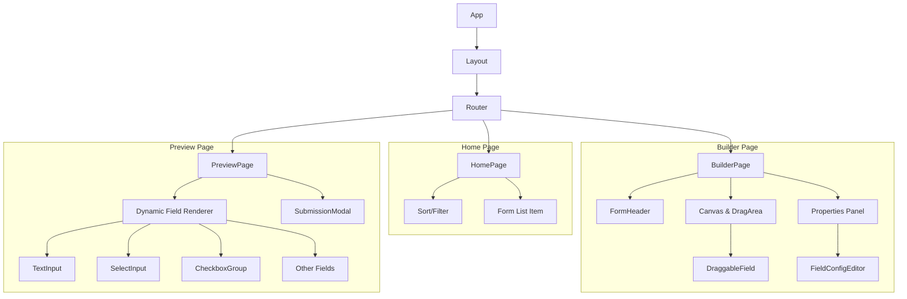

# React Form Builder

A powerful, responsive, and interactive Form Builder application built with React, allowing users to create, customize, and preview dynamic forms with ease.

## 🚀 Features

- **Dynamic Form Creation**: Add and configure various field types (Text, Number, Date, Time, Dropdowns, Checkboxes, etc.).
- **Drag-and-Drop Interface**: Reorder fields intuitively.
- **Real-time Preview**: Test your form interactivity instantly.
- **Validation**: Built-in support for required fields, min/max lengths, and patterns.
- **Export Data**: View submitted form data as JSON.
- **Dark Mode**: Fully responsive dark/light theme support.
- **Responsive Design**: Optimized for desktop, tablet, and mobile.

## 🛠️ Setup Instructions

### Prerequisites
- Node.js (v18 or higher)
- npm (v9 or higher)

### Installation
1.  **Clone the repository:**
    ```bash
    git clone https://github.com/yourusername/react-form-builder.git
    cd react-form-builder
    ```

2.  **Install dependencies:**
    ```bash
    npm install
    ```

3.  **Run the development server:**
    ```bash
    npm run dev
    ```

4.  **Build for production:**
    ```bash
    npm run build
    ```

## 📦 Libraries Used & Justification

| Library | Purpose | Justification |
| :--- | :--- | :--- |
| **React** | Core Framework | Industry standard for building interactive UIs with a component-based architecture. |
| **Vite** | Build Tool | Extremely fast hot module replacement (HMR) and optimized build process. |
| **Zustand** | State Management | Lightweight, boilerplate-free alternative to Redux for managing global app state (`activeForm`, `allForms`). |
| **Tailwind CSS** | Styling | Utility-first CSS framework for rapid, consistent, and responsive styling without context switching. |
| **@hello-pangea/dnd** | Drag & Drop | Modern, accessible, and maintained fork of `react-beautiful-dnd` for the builder interface. |
| **React Hook Form** | Form Logic | (Conceptually used logic, implemented via custom handlers for max flexibility in the builder). |
| **date-fns** | Date Formatting | Lightweight and immutable date utility library for handling date/time inputs. |
| **Lucide React** | Icons | Clean, consistent, and customizable SVG icons. |
| **clsx / tailwind-merge** | Class Utilities | Essential for conditionally applying Tailwind classes and resolving conflicts in reusable components. |

## 🏗️ Architecture & Design Approach

My design philosophy focuses on **modularity**, **reusability**, and **separation of concerns**. The application is structured to decouple the *builder logic* from the *rendering logic*, allowing the preview engine to be potentialy reused in a different context (e.g., a standalone viewer).

### Folder Structure Overview

```
src/
├── components/
│   ├── ui/           # Generic, atomic UI components (AppInput, AppButton, etc.)
│   ├── fields/       # Form-specific logic wrappers (TextInput, DateInput, etc.)
│   └── builder/      # Components specific to the Builder interface (Sidebar, Canvas)
├── pages/            # Top-level route components (Home, Builder, Preview)
├── store/            # Global state management (Zustand)
├── hooks/            # Custom reusable hooks
├── utils/            # Helper functions (validation, rules, formatters)
└── assets/           # Static assets and global styles
```

### Component Wireframe / Hierarchy

The application flows through three main pages. Here is how they are composed:



### Key Architectural Decisions

#### 1. Generic UI Components (`src/components/ui`)
I created a set of "dumb" presentation components (prefixed with `App`, e.g., `AppTextInput`, `AppDropdown`).
-   **Why?** This ensures UI consistency across both the **Editor Sidebar** and the **Live Preview**.
-   **Benefit:** Changing the style of `AppTextInput` updates it everywhere instantly.

#### 2. Separation of Field Logic vs. UI
The `src/components/fields` directory contains "smart" wrappers (e.g., `TextInput.jsx`).
-   **Responsibility:** These components handle form-specific logic like extracting props, handling validation errors, and connecting to the `Generic UI` layer.
-   **Result:** cleaner code and easier unit testing.

#### 3. State Management (Zustand)
I chose Zustand over Redux or Context API.
-   **Why?** It avoids "Provider Hell" and simple interactions like adding a field or updating a label shouldn't require complex reducers. It allows `BuilderPage` and `Sidebar` to sync effortlessly.

#### 4. Utilities & Helpers
-   `validation.js`: Centralized validation logic. This allows shared validation rules between the Builder configuration and the Preview execution.
-   `rules.js`: Handles complex logic like conditional visibility (if implemented) or field enablement checks.

#### 5. Custom Hooks
-   `useFormStore`: Encapsulates all form-related CRUD operations.

---

## ✅ Problem Statement Checklist

- [x] **Build Form Button**: Create new forms from the dashboard.
- [x] **Field Types**: Support for Text, Number, TextArea, Dropdown, Checkbox, Radio, Date, Time, Slider, Rating, Toggle.
- [x] **Field Configuration**: Edit labels, options, placeholders, and validation rules.
- [x] **Drag & Drop**: Reorder fields in the builder.
- [x] **Preview & Submit**: Live interaction and JSON data export.
- [x] **Bonus**: Dark Mode, Validation (Required, Min/Max), Responsive Design.

---

## 🎨 Design & Customization

The project uses a clean, modern aesthetic with careful attention to whitespace and typography.
-   **Theme:** Configurable Accent Colors (Indigo, Pink, Orange, etc.).
-   **Dark Mode:** Built-in via Tailwind's `dark:` modifier.

## 📄 License

This project is open-source and available for evaluation purposes.